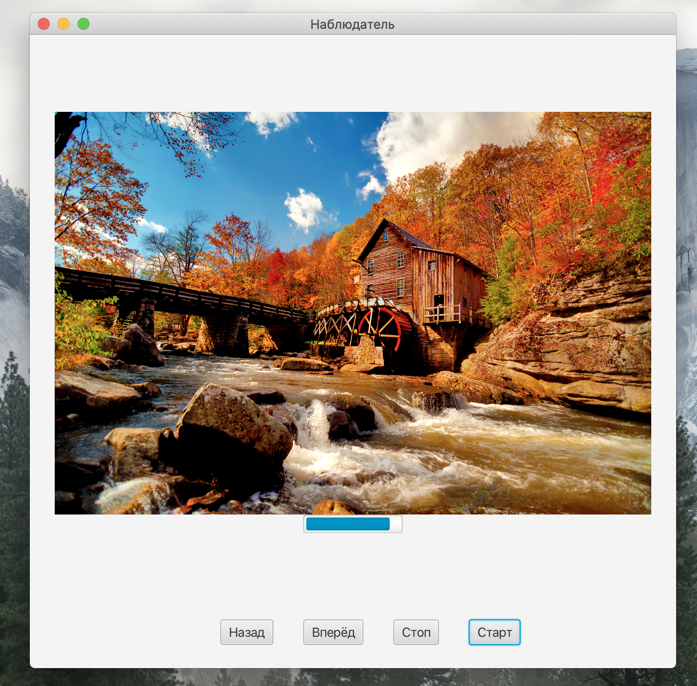

В рамках данной лабораторной работы был на практике реализован паттерн проектирования "Наблюдатель".

В ходе выполнения работы было создано два устройства-слушателя:
- Посмоторщик картинок (использует патерн "Итератор")
- Прогресс Бар (Progress Bar)

Главным объектом (объект за изменениями которого следят слушатели) является объект TimeServer. При создании экземпляра данного объекта, автоматически запускается метод tiсk(), который выполняет функцию отсчёта времени. При каждом "тике" (в данном случае "тик" равен 1 секунде) вызовется метод notifyAllObservers(), который занимается оповещением всех слушателей (в данном случае два устройства).
## Зависимости
Для корректной работы данного приложения требуется наличие у пользователя ОС Windows не ниже 7 версии, а также установленная на ПК Java.

## Установка
Для корректной работы с программным кодом требуется наличие следящих компонентов:
- Java 11
- Maven
- JavaFx

## Демонстрация проекта:
[
[
[
