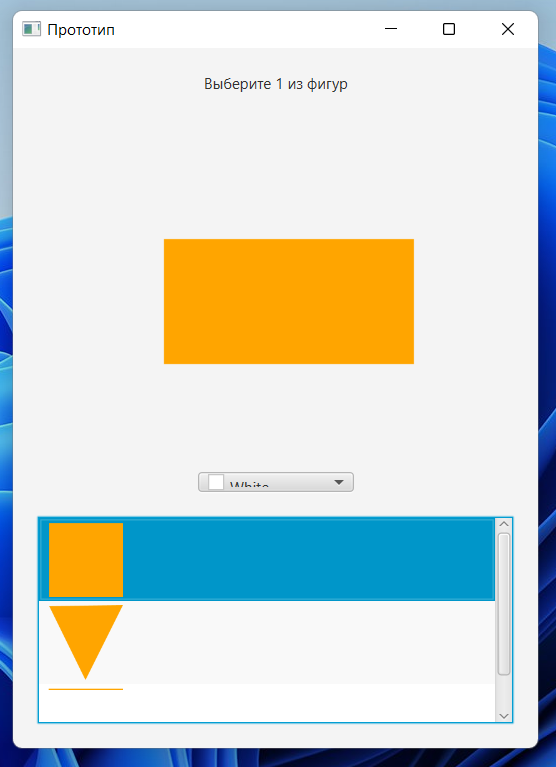
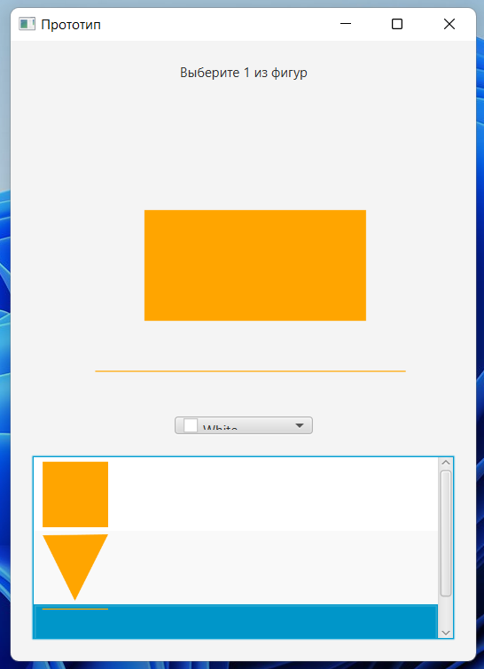
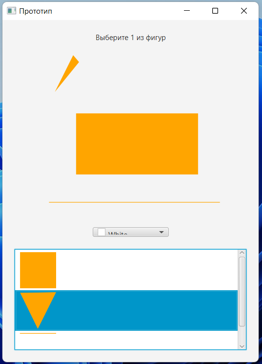

В рамках данной лабораторной работы бвл на практике реализован патерн проектирования "Наблюдатель".

В ходе выполнения работы было созданно два устройства-слущателя:
- Посмоторщик картинок (использует патерн "Итератор")
- Прогресс Бар (Progress Bar) 

Главным объектом (объект за изменениями которого следят слушатели) является оюбъект TimeServer. При создании экземпляра данного объекта, автоматически запускается метод tiсk(), который выполняет функцию отсчёта времени. При каждом "тике" (в данном случае "тик" равен 1 секунде) вызывется метод notifyAllObservers(), который занимется оповищением всех слушателей (в данном случае два устройства).
## Зависимости
Для корректной работы данного приложения требуется наличие у пользователя ОС Windows не ниже 7 версии, а также установленная на ПК Java.

## Установка
Для корректной работы с программным кодом требуется наличие следящих компонентов:
- Java 11
- Maven
- JavaFx 

## Демострация проекта:
[
[
[
